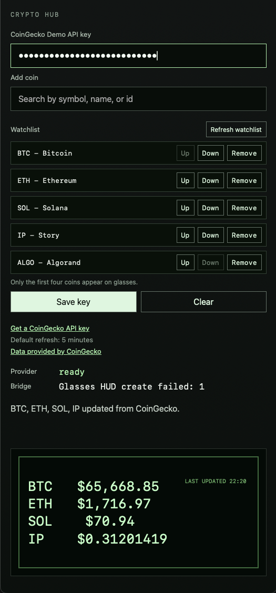

<p align="center">
  
</p>

# Even Crypto HUD

A small TypeScript Even Hub app for showing a crypto watchlist on Even G2 glasses.

The app uses CoinGecko as a read-only price and market activity data provider, lets the user enter a CoinGecko Demo API key, and renders the watchlist as four-coin pages in a pixel-style HUD card.

It does not trade, place orders, or connect to wallets.

## Screenshots

| Phone app | Glasses HUD |
| --- | --- |
|  |  |

## What It Does

Shows live crypto prices on Even glasses.

## Requirements

- Node.js 20+
- pnpm 10+
- Even Realities App with Even Hub / Developer Center access
- Even G2 paired to the phone for hardware testing
- CoinGecko Demo API key

## Setup

```bash
pnpm install
```

## Run Locally

```bash
pnpm run dev
```

Vite runs with `--host 0.0.0.0`, so a phone on the same Wi-Fi network can open the dev server.

Use the LAN URL Vite prints, for example:

```text
http://192.168.1.23:5173/
```

Do not use `localhost` on the phone; that points to the phone itself.

## Test On Phone

Start the dev server:

```bash
pnpm run dev
```

Generate an Even Hub QR code for the dev server:

```bash
pnpm exec evenhub qr --url http://<your-mac-lan-ip>:5173/
```

Then scan the QR code from the Even Realities App developer area and launch the app on the phone.

## Simulator

```bash
pnpm simulator
```

This starts Vite on `127.0.0.1:5173`, waits for it to be ready, then starts the EvenHub simulator with automation on port `9898`. Press `Ctrl-C` once to stop both processes.

For automated screenshots while `pnpm simulator` is running:

```bash
curl -fsS http://localhost:9898/api/screenshot/glasses -o /tmp/even-crypto-glasses.png
```

## Release

Packaged builds are published on the GitHub Releases page:

https://github.com/RageCoke1466/even-crypto-hud/releases

To publish a new release, bump the `version` in both `package.json` and `app.json`, then merge the change to `main`.

The release workflow creates `v<version>` and uploads `even-crypto.ehpk`.

## Verification

```bash
pnpm test
pnpm run typecheck
pnpm run build
```

## Notes

- Price refresh interval is 5 minutes.
- The right-lower market activity scale is derived from CoinGecko volume, volatility, and trending data.
- CoinGecko catalog cache lasts 30 minutes.
- Glasses show four watchlist coins per page. Scroll down for the next page and scroll up for the previous page.
- `app.json` grants network access only to `https://api.coingecko.com`.
- The app logs non-secret diagnostics with the `[even-crypto]` prefix.
